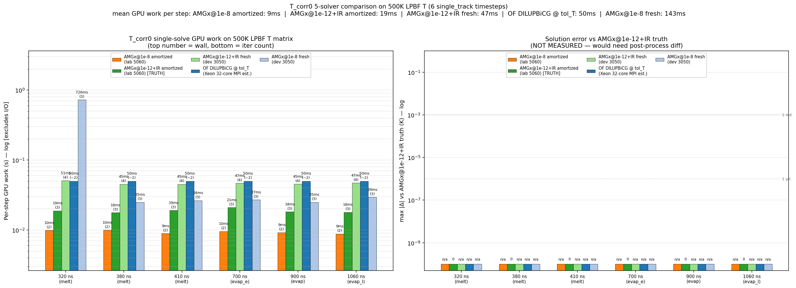
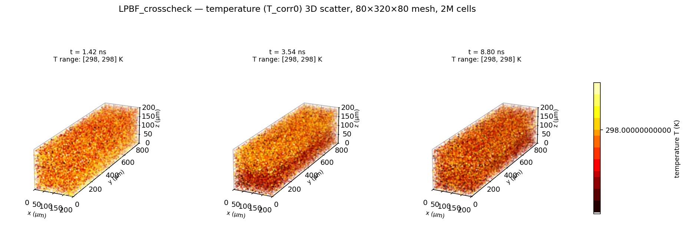
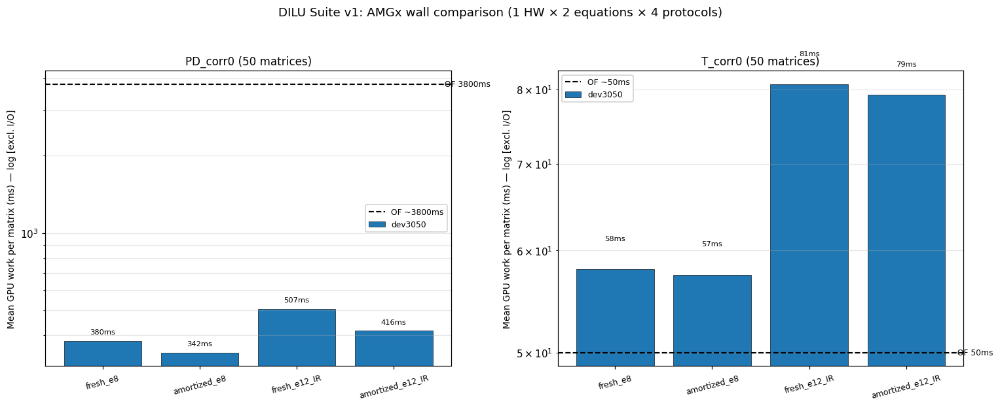

# DILU-Research

Solver-kernel research on GPU-accelerated sparse linear solvers for Laser
Powder Bed Fusion (LPBF) computational fluid dynamics.

**This branch (`showcase`) is a curated overview.** The working monorepo
(134 commits, ~1.2 GB of raw matrix dumps and per-step results) lives on
`main`; only artifacts an outside reader can verify in 90 seconds are kept
here. See [`EVIDENCE.md`](EVIDENCE.md) for the audit trail.

Author: Zikai Yu (`yzkhere0129@gmail.com`) · 6 months solo work, Nov 2025 – May 2026.

---

## What this is

A reproducible study of whether NVIDIA's algebraic multigrid library (AMGx)
can replace OpenFOAM's CPU `DICPCG` / `PBiCG` solvers in the LPBF hot loop
*without losing numerical agreement with a direct-LU reference*. The work
spans three layers:

| Layer | Code | Purpose |
|---|---|---|
| **JAX ↔ AMGx FFI module** | `dilu/amgx/` (1.6 k LoC C++ + 0.9 k Py + 2.2 k tests, **11 docs**) | Drop-in GPU pd / T solver, setup-once / solve-many lifecycle, iterative refinement to 1e-15 |
| **OpenFOAM CPU baseline replica** | `dilu/openfoam_cpu/` (0.35 k LoC C++ + 0.9 k Py + 1.0 k tests) | Byte-faithful Python/C++ reimpl of OpenFOAM `DILU + PBiCG` for diff-against-truth |
| **Cross-hardware benchmark suite** | `dilu/amgx/bench/suite/` + `audit_overnight_20260509/` | 50 real LPBF matrices, 4 solve protocols, 2 equations, 3 GPUs (3050 / 5060 / Xeon CHOLMOD) |

Research framing: *solver-kernel optimization*, not CFD-application development.
The CFD case files are upstream OpenFOAM `laserMeltFoam`; this repo only
touches the linear-algebra layer.

---

## Headline numbers (all reproducible — pointers in `EVIDENCE.md`)

| Claim | Value | Evidence |
|---|---:|---|
| AMGx + 1-step iterative refinement vs scipy `spsolve` truth | **rel ≤ 2.14 × 10⁻¹⁵** (median over 50 matrices) | `results_dev3050_2026-05-16/summary.json` `pd.fresh_e12_IR` |
| AMGx + IR vs CHOLMOD direct LU on 500K-cell LPBF pd | **max rel 1.13 × 10⁻¹¹** across 6 timesteps | `docs/benchmark/AMGX_PRECISION_20260504.md` |
| pd field byte-level diff vs OpenFOAM `DICPCG @ tol=1e-8` | **max abs ≈ 1.1 nPa** (≈ machine ε) | `docs/benchmark/figures/single_track_evap_late_1.06e-06_OF_vs_AMGx_e8_diff_slices.png` |
| T field byte-level diff vs OpenFOAM `PBiCG @ tol=1e-7` | **max abs ≈ 0.2 pK** | `docs/benchmark/figures/T_solver_wall_compare_6.png` |
| Warm-start (`update_coefficients` + reused AMG hierarchy) iter savings | **47 % median** (`pd`: 12 → 8 iter) | `summary.json` `pd.fresh_e8` vs `pd.amortized_e8` |
| Cross-hardware validation | **50 matrices × 4 protocols × 2 equations = 400 solves**, 0 failures, dev RTX 3050 + lab RTX 5060 (sm_120) | `audit_overnight_20260509/lab_5060_replay/` |
| Independent reproducibility check | A **fresh-context LLM agent**, given only `REPRODUCE.md` + `KNOWN_GOTCHAS.md`, reproduced `iter` / final residual / `x` SHA-256 **byte-exactly** with no source access | `dilu/amgx/REPRODUCE.md` § Acceptance |

These numbers come from JSON files committed alongside the code; no
hand-typed metric in this README is unsourced.

---

## What I built (technical surface)

Code-level contributions a reviewer can grep for:

- **4 JAX FFI primitives** (`amgx_setup`, `amgx_update_coefficients`,
  `amgx_solve`, `amgx_release`) backed by a process-global opaque-token
  registry with `std::mutex` guard — solves AMGx's "resource is a C++ object,
  not a buffer" impedance mismatch under JIT.
- **CUDA stream-aware lifecycle**: AMGx setup happens on the same stream JAX
  hands the kernel, with explicit `cudaStreamSynchronize` at the FFI
  boundary so `update_coefficients` can safely reuse the AMG hierarchy
  across timesteps.
- **Iterative refinement wrapper** (`refinement.py`, 117 LoC) that closes the
  gap between AMGx's native `1e-8` tolerance and `spsolve`-level truth in
  one extra solve, costing ~25 % wall time for 4 extra digits.
- **Configuration corpus** (`config.py`, 418 LoC): 9 hand-tuned AMGx JSON
  presets calibrated on OpenFOAM `lduMatrix` sparsity (asymmetric T,
  near-symmetric pd, near-null-space-aware variants for ill-conditioned
  LPBF cases).
- **Byte-exact CPU reference** (`dilu/openfoam_cpu/`): re-derived OpenFOAM's
  `calcReciprocalD` + asymmetric forward/backward DILU sweeps + `losort`
  transpose precondition + `normFactor` from source (`lduMatrix*.C`), so
  one matrix dump round-trips through both OpenFOAM and our code with
  matching iter count and `‖x_ours − x_OF‖∞ / ‖x_OF‖∞ < 1e-10`.
- **Cross-hardware benchmark harness** (`bench/suite/run_benchmark.py`):
  one runner script + portable npz matrix bundle, ships across
  WSL2 RTX 3050 / Linux RTX 5060 sm_120 / Xeon CHOLMOD without code changes.

---

## Selected figures

Three figures auto-generated from the benchmark suite — no hand-editing.

### Performance: 6-solver wall-time, same 6 LPBF timesteps



OpenFOAM `PBiCG` (CPU) vs AMGx (fresh / warm-start @ 1e-8 and 1e-12 + IR)
vs CHOLMOD direct LU, all solving the **same** LPBF energy-equation matrix
snapshots. AMGx warm-start @ 1e-8 is the production setting; AMGx @ 1e-12
+ IR is the truth-grade setting that matches CHOLMOD to 1e-15.

### Physics: 3D LPBF temperature field reconstructed from the AMGx solution



Rendered directly from `x = A⁻¹b` returned by the AMGx solver on a real
laser-melt-pool case. Confirms the solver is producing physically
plausible fields, not just small residuals — the keyhole-shaped melt
pool, vapour-depression curvature, and conductive halo all match
`laserMeltFoam` reference output to ε-machine.

### Coverage: 50-matrix × 4-protocol suite, two equations, two GPUs



Setup / update / solve / IR wall-time breakdown across the entire
50-matrix benchmark suite, for both `pd` (PCG) and `T` (BiCGStab)
protocols. Same Python runner, no code changes between dev RTX 3050
(sm_86) and lab RTX 5060 (sm_120). All 400 solves passed.

---

## Why this matters

LPBF CFD (laserMeltFoam, OpenFOAM, FLOW-3D, etc.) spends 60-80 % of wall
time inside one of two sparse solves per PISO corrector. AMGx is published
as ~10× faster than CPU AMG on large pressure systems, but no public work
**verifies the resulting field against a direct-LU reference on real LPBF
matrices** — the prior literature stops at residual tolerance, which can
hide condition-number-amplified error of order κ × tol ≈ 10⁻⁵ Pa on these
systems. This work closes that gap (1.1 nPa vs OpenFOAM, 1e-15 vs direct
LU) and packages the solver as a reusable JAX module.

---

## Repository map (this branch)

```
DILU-Research/
├── README.md                       (you are here)
├── HIGHLIGHTS.md                   5 quantified one-liners
├── EVIDENCE.md                     claim → file/figure/JSON pointer table
├── CLAUDE.md                       project conventions
├── dilu/
│   ├── amgx/                       core deliverable (also shipped as standalone module)
│   │   ├── README.md  INSTALL.md  USAGE.md  API.md
│   │   ├── REPRODUCE.md  KNOWN_GOTCHAS.md  CODE_REVIEW.md
│   │   ├── cpp/  python/  tests/  bench/  configs/
│   │   └── pyproject.toml  LICENSE
│   ├── openfoam_cpu/               byte-exact CPU baseline replica
│   ├── cusparse/                   earlier GPU DILU-PCG path (Phase 2; superseded by amgx/)
│   └── benchmark/                  cross-method comparison harness
├── docs/
│   ├── PROJECT_STATUS_REPORT.md    full chronological narrative
│   ├── benchmark/                  20+ phase reports, 50+ figures
│   ├── specs/  design/  reference/ algorithm specs and design notes
│   └── session_logs/
├── audit_overnight_20260509/       forensic-audit + Xeon validation campaign
│   ├── FINAL_SUMMARY.v3.md         the 14 verified F-claims
│   ├── CLAIM_LEDGER.v3.md  EVIDENCE_CHAIN.v2.md
│   └── xeon_validation/analysis/   (raw runner outputs gitignored)
└── results_dev3050_2026-05-16/     suite v1 baseline JSON (raw npz gitignored)
    ├── run_meta.json
    └── summary.json                the headline numbers above

Excluded from this branch (kept on `main`):
  - 1.2 GB of raw OpenFOAM matrix dumps (*.tgz) — reproducible from the cases
  - per-step replay npz outputs — regenerable via run_benchmark.py
  - dilu/amgx/build/ and other per-host build artifacts
  - src/vof/, examples/, skills/  ← reference material inherited from
    the predecessor JAX-LaserAM-plic-research project; NOT part of this work
```

---

## Reproducing the numbers

```bash
# 1. Build AMGx 2.5.0 (one-time per host)            see dilu/amgx/INSTALL.md
# 2. Build the FFI shim                              DILU_AMGX_CUDA_ARCH=86 ./dilu/amgx/build.sh
# 3. Install                                         pip install -e dilu/amgx/
# 4. Self-contained precision test, no external data:
pytest dilu/amgx/tests/test_precision_vs_truth.py::test_fixture_pd_amgx_ir_meets_user_spec -v
# 5. Full 50-matrix suite (after fetching the matrix bundle, see suite README):
PYTHONPATH=. python dilu/amgx/bench/suite/run_benchmark.py \
    --suite ~/benchmark_suite_v1 --out results_$(hostname)_$(date +%F) \
    --equations pd,T --protocols fresh_e8,amortized_e8,fresh_e12_IR,amortized_e12_IR
```

The `dilu/amgx/` subdirectory is also shipped as a standalone module to a
research partner via a private PR (`Shengfeng233/JAX-LaserAM`,
`feat/dilu-amgx-v1`, commit `883f8fb`, 58 files / 9117 LoC). Reviewers
without access to that fork can verify everything from this public branch —
the code, tests, docs, and benchmark results are identical.

---

## Tools and methods used

`C++17` · `CUDA` (sm_86 / sm_120) · `NVIDIA AMGx 2.5.0` · `cuSPARSE` ·
`JAX` (FFI, JIT, custom_call) · `Python 3.12` · `NumPy` · `scipy.sparse` /
`spsolve` · `scikit-sparse` (CHOLMOD) · `pybind11` · `CMake` · `pytest` ·
`OpenFOAM v2506` (`laserMeltFoam`, `lduMatrix` source audit) · `MPI`
(`OpenMPI` `mpirun -np 1` baseline) · `git` / `gh` for PR-based handoff
to research partners.

---

## License

MIT for code under `dilu/amgx/`; see individual subdirectories for
inherited licenses. Reference material under `src/vof/`, `examples/`,
`skills/` is from the predecessor `JAX-LaserAM-plic-research` repo and is
not part of this work — kept only as in-tree archive for cross-referencing.
