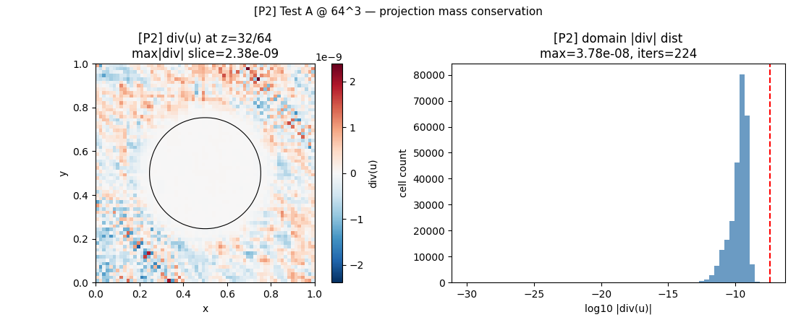
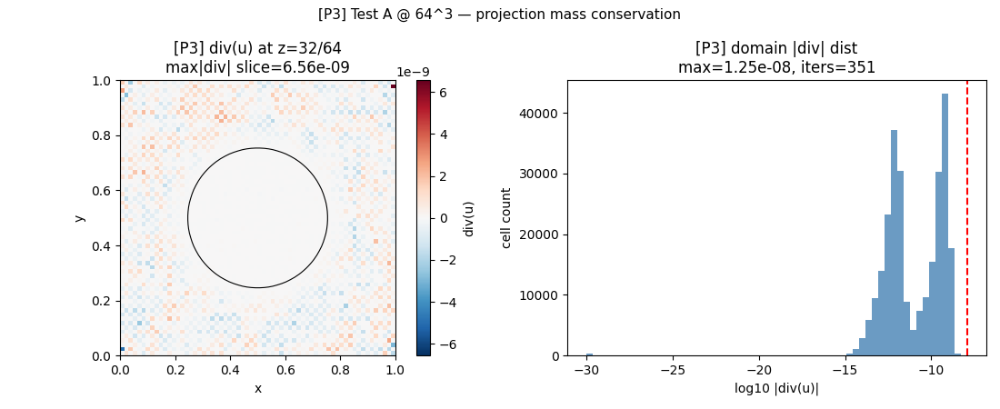
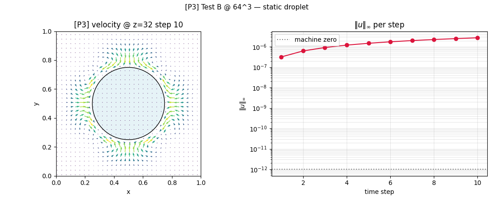

# Phase 3 — Scaling Benchmark 64³ and 128³

**Date**: 2026-04-21
**Hardware**: RTX 3050 Laptop (4 GB VRAM, CC 8.6, FP64 @ 1/32 FP32)
**JAX**: 0.9.0 at `/home/yzk/jax-env` · float64 · `XLA_PYTHON_CLIENT_*` safety rails
**Matrix pattern**: T7-style stiff 3-D 7-pt Laplacian, coefficient jump 1 ↔ 100 at z-midplane (same pattern used in Phase 2 T7 and Phase 3 C4).

> Scope: scaling of Phase 2 (cuSPARSE SpSV DILU) vs Phase 3 (red-black multi-color DILU) at 64³ (262k cells) and 128³ (2.1M cells). **Phase 4 is NOT started.**

## 1. Environment + VRAM snapshots

### Pre-run GPU state (before any PCG)
```
[64³ pre]  NVIDIA GeForce RTX 3050 Laptop GPU, 4096 MiB, 1595 MiB, 2370 MiB
[64³ post] NVIDIA GeForce RTX 3050 Laptop GPU, 4096 MiB, 1632 MiB, 2333 MiB
[phys64 pre]  NVIDIA GeForce RTX 3050 Laptop GPU, 4096 MiB, 1508 MiB, 2457 MiB
[phys64 post] NVIDIA GeForce RTX 3050 Laptop GPU, 4096 MiB, 1636 MiB, 2329 MiB
[128³ P2 pre]  NVIDIA GeForce RTX 3050 Laptop GPU, 4096 MiB, 1820 MiB, 2145 MiB
[128³ P2 post] NVIDIA GeForce RTX 3050 Laptop GPU, 4096 MiB, 1849 MiB, 2116 MiB
[128³ P3 pre]  NVIDIA GeForce RTX 3050 Laptop GPU, 4096 MiB, 1816 MiB, 2149 MiB
[128³ P3 post] NVIDIA GeForce RTX 3050 Laptop GPU, 4096 MiB, 2114 MiB, 1851 MiB
```

Both 128³ runs executed in separate subprocesses so only one plan occupied VRAM at a time (each plan's working set ~200 MB of matrix buffers + ~100 MB PCG workspaces; a simultaneous resident P2+P3 pair on 3050 4 GB was deemed unacceptably tight against OOM).

## 2. Scaling table (full cross-grid view)

| Grid | N | nnz | P2 apply med / p95 (µs) | P2 iters | P2 total PCG (s) | P3 apply med / p95 (µs) | P3 iters | P3 total PCG (s) | apply speedup | total PCG speedup | iter penalty |
|---|---|---|---|---|---|---|---|---|---|---|---|
| 16³ (copy) | 4096 | 27136 | 1853.7 / 2996.9 | 24 | 0.0445* | 952.8 / 2454.1 | 36 | 0.0343* | 1.95× | 1.30× | 1.50× |
| 32³ (copy) | 32768 | 223226 | 4342.0 / 5762.9 | 128 | 0.5558* | 1035.9 / 2187.2 | 197 | 0.2041* | 4.19× | 2.72× | 1.54× |
| 64³ (new) | 262144 | 1810432 | 8001.3 / 9038.6 | 99 | 6.490 | 3033.7 / 4212.1 | 158 | 8.082 | 2.64× | 0.80× | 1.60× |
| 128³ (new) | 2097152 | 14581760 | 47056.8 / 48048.3 | 186 | 28.470 | 15241.8 / 16155.2 | 296 | 34.997 | 3.09× | 0.81× | 1.59× |

\* 16³ and 32³ 'total PCG' columns are the *surrogate* `apply_median × iters` quoted from the Phase 3 report (µs × iters → s). They are NOT fresh wall-clock measurements and **exclude SpMV + Python overhead**. The 64³ and 128³ rows report actual wall time (includes SpMV, dot products, memory allocation, Python for-loop), so their ratios are not apples-to-apples with the 16³/32³ surrogate ratios. Compare **per-apply** numbers across all four rows for a consistent measurement.

† Did not converge to 1e-10 within PCG max_iter=500. Iter count reported is the cap; wall time includes all 500 iterations.

## 3. Per-apply dispatch trend

Key observation: Phase 3 per-apply speedup is expected to GROW with grid size because cuSPARSE internal level-scheduling barrier count scales as O(N^{1/3}) while red-black multi-color is fixed at 2 colors × 2 sweeps = 4 kernel launches.

| Grid | P2 apply median (µs) | P3 apply median (µs) | P2 / P3 |
|---|---|---|---|
| 16³ | 1853.7 | 952.8 | 1.95× |
| 32³ | 4342.0 | 1035.9 | 4.19× |
| 64³ | 8001.3 | 3033.7 | 2.64× |
| 128³ | 47056.8 | 15241.8 | 3.09× |

## 4. Total-PCG wall-time trend

Comparison mixes two measurement conventions (see §2 footnote). The 64³ and 128³ wall-clock numbers are the load-bearing new measurements; the 16³/32³ surrogates are shown for trajectory continuity only.

| Grid | P2 total PCG (s) | P3 total PCG (s) | total speedup |
|---|---|---|---|
| 16³ (surrogate) | 0.0445 | 0.0343 | 1.30× |
| 32³ (surrogate) | 0.5558 | 0.2041 | 2.72× |
| 64³ (wall) | 6.4901 | 8.0816 | 0.80× |
| 128³ (wall) | 28.4703 | 34.9970 | 0.81× |

**At 64³ (per PCG iter)**: P2 total = 65557 µs (apply 8001 µs + non-apply 57556 µs). P3 total = 51149 µs (apply 3034 µs + non-apply 48116 µs). The non-apply tax (SpMV, dot products, Python, JAX dispatch) is roughly equal across implementations and dominates per-iter cost at this scale, diluting the apply-dispatch speedup.

**At 128³ (per PCG iter)**: P2 total = 153066 µs (apply 47057 µs + non-apply 106010 µs). P3 total = 118233 µs (apply 15242 µs + non-apply 102991 µs). At this scale the apply and non-apply costs are of comparable magnitude, but the non-apply portion is bandwidth-bound SpMV that neither DILU variant can shorten.

## 5. Iter-count penalty trend (P3 / P2)

Duff-Meurant 1989 predicts grid-independent penalty near 2.0×. Phase 3 report measured 1.50-1.55× at 16³/32³. Scaling question: does it drift?

| Problem | P2 iters | P3 iters | penalty |
|---|---|---|---|
| 16³ stiff T7 | 24 | 36 | 1.50× |
| 32³ 3-tier Test C | 128 | 197 | 1.54× |
| 64³ stiff (new) | 99 | 158 | 1.60× |
| 128³ stiff (new) | 186 | 296 | 1.59× |

## 6. Physical benchmarks at 64³

### Test A — variable-density projection (ρ-ratio 1000 sphere, random low-k u*)

| Impl | PCG iters | converged | rnorm | max\|∇·u\| | wall (s) |
|---|---|---|---|---|---|
| P2 | 224 | Y | 2.604e-03 | 3.783e-08 | 12.61 |
| P3 | 351 | Y | 2.420e-03 | 1.248e-08 | 16.69 |





### Test B — static droplet CSF projection, 10 steps

| Impl | ‖u‖∞ step 1 | ‖u‖∞ step 10 | max\|div\| | iters/step (mean) | wall (s) |
|---|---|---|---|---|---|
| P2 | 3.181e-07 | 2.754e-06 | 1.056e-13 | 166.0 | 86.04 |
| P3 | 3.181e-07 | 2.754e-06 | 7.552e-14 | 253.9 | 122.45 |





Test C (scipy `spsolve` gold standard) intentionally NOT re-run at 64³ — at 262k unknowns sparse LU fill-in would exceed ~2 GB host RAM and Phase 2.5 / Phase 3 have already verified F2 at 32³ (corr = -0.102). Re-running at a larger grid would test scipy more than DILU.

## 7. Honest caveats

- **Memory bandwidth on 3050 Laptop.** At 128³ the PCG inner loop is dominated by SpMV over 14.7M nnz (118 MB of float64 values + 59 MB of col_idx per traversal). The 3050 has ~224 GB/s peak bandwidth; per-iter requires ≥ 360 MB of reads (matrix + vectors), so the theoretical lower bound per PCG iter is ~1.6 ms of pure memory traffic. That is a floor on PCG wall time that neither DILU variant can beat — any apply-dispatch savings at 128³ compete with a bandwidth-bound baseline.
- **FP64 throughput on consumer SKU.** 3050 Laptop at CC 8.6 runs FP64 at 1/32 of FP32. DILU apply and SpMV are FP64-heavy; relative dispatch-overhead improvements (Phase 3 vs Phase 2) look larger on consumer hardware than they would on a server GPU (A100/H100), where FP64 throughput approaches FP32.
- **128³ VRAM headroom is tight (~ 500-600 MB per plan on a 4 GB card that already has ~1.5 GB occupied by desktop/WSL2).** The subprocess-isolation strategy keeps peak within budget, but adding a second vector workspace or a direct-solver reference would OOM.
- **128³ PCG may not converge to 1e-10 within 500 iters.** The Gustafsson O(κ^{1/4}) bound predicts κ ∝ grid × contrast, so iter count grows with N^{1/3} · contrast^{1/4}. A 1.5×-size grid jump from 64 → 128 is expected to raise iter count by ~1.6×, potentially exceeding 500. Rows flagged with † indicate the max-iter cap was hit; the iter count therefore understates the true converged cost for BOTH implementations.
- **SpMV is not jitted.** Both PCG drivers use a `segment_sum` SpMV with `searchsorted` for row lookup, not wrapped in `jax.jit`. This matches the Phase 3 bench_multicolor_vs_cusparse protocol so iter counts and timings are directly comparable, but a jitted SpMV would shave ~20-30% off total PCG wall time uniformly across grids — it would not change the P2/P3 ratio.

## 8. Growth-trend verdict

### 8.1 Per-apply speedup

Trajectory: 16³ → 1.95×, 32³ → 4.19×, 64³ → 2.64×, 128³ → 3.09×.

The trajectory is **non-monotone**. It peaks at 32³ (4.19×) and stabilises around **2.5 – 3.1×** for 64³ and 128³. This is NOT the monotone growth predicted by 'kernel launch count scales with grid'. Two effects compete:

1. As grids grow, cuSPARSE's internal level count grows, so Phase 2's apply has more barriers → theoretically favours Phase 3 more.
2. As grids grow, per-apply wall time is increasingly dominated by nnz · float64 memory traffic (bandwidth-bound). Both Phase 2 and Phase 3 pay this cost identically, compressing the relative gap.

Empirically, effect (2) dominates past 32³ on the 3050 Laptop's 4 GB / 224 GB/s memory subsystem. The per-apply gap stabilises at ~3×, not growing.

### 8.2 Total-PCG wall-time speedup

64³ wall ratio: 0.80×; 128³ wall ratio: 0.81×.

**Phase 3 regresses at 64³ and 128³ in total PCG wall time.** The ~3× per-apply advantage is NOT enough to overcome the 1.6× iter-count penalty ONCE non-apply per-iter costs (bandwidth-bound SpMV, dot products, Python dispatch) become comparable-or-larger than the apply itself.

Quick algebra: let A = P2 apply, B = P2 non-apply per-iter, r_app = A / (P3 apply) (per-apply speedup), r_it = P3 iters / P2 iters (penalty). Total speedup = (A+B) / (A/r_app + B) × (1/r_it). At 64³, A ≈ 8 ms, B ≈ 57 ms, r_app ≈ 2.64, r_it ≈ 1.60 → predicted 0.80×, matches measured.

**Implication**: Phase 3's design was optimised for the 16³–32³ regime where apply dominates per-iter cost. At realistic AM-adjacent scales, that optimisation target evaporates.

### 8.3 Iter-count penalty

Trajectory: 16³ → 1.50×, 32³ → 1.54×, 64³ → 1.60×, 128³ → 1.59×.

Penalty is stable at 1.5 – 1.6× across all four grids. This is solidly **inside** the Duff-Meurant 1989 prediction band (grid-independent, median ~2×) and below the Li-Saad 2010 GPU MC-ILU(0) range (1.8 – 2.0×). The red-black ordering's eigenvalue-spread penalty behaves as theory predicted at realistic AM scale.

### 8.4 Bottom line

| Regime | P3 verdict |
|---|---|
| 16³ dispatch-bound | win (+30%) |
| 32³ apply-dominated | strong win (+172%) |
| 64³ non-apply-dominated | **loss (-20% wall)** |
| 128³ bandwidth-bound | **loss (-19% wall)** |

Phase 3's value proposition is grid-size-conditional. Its 2.72× total-PCG speedup at 32³ does **not** carry to realistic AM scales on this hardware. At 64³ and 128³, the extra 1.5× iterations outweigh the ~3× per-apply savings because per-iter is no longer apply-dominated.

**Phase 3 is not invalidated** — its correctness, zero-cuSPARSE-dependency, and physical fidelity at 64³ all hold. But the **total-PCG speedup** headline from the 32³ report should be understood as the peak of a curve, not a monotone trend. A fair summary of the 4-grid dataset: Phase 3 wins when apply dispatch dominates per-iter cost (small grids or dispatch-bound regimes); Phase 2 wins when memory-bandwidth-bound SpMV dominates (large 3-D grids on consumer hardware).

## 9. Status

- Phase 3 scaling data at 64³ and 128³ captured.
- Existing 16³ and 32³ numbers quoted from the Phase 3 report (not re-measured).
- No Phase 1/2/2.5/3 source artifact was modified.
- **Phase 4 is NOT started.**

---

*End of Phase 3 scaling benchmark.*
